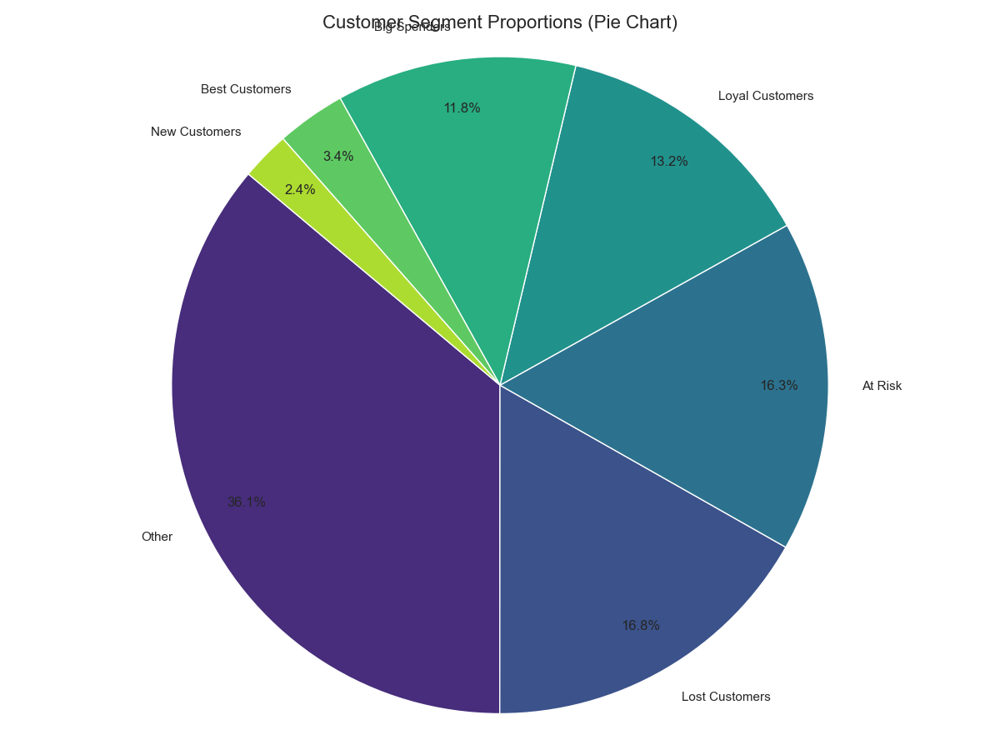

# Customer Segmentation with RFM Analysis

This project performs a complete RFM (Recency, Frequency, Monetary) analysis on a customer dataset to segment customers into distinct behavioral groups. The goal is to identify high-value, loyal, and at-risk customers to enable targeted marketing strategies.

---

## 📊 Key Visualizations & Insights

This analysis resulted in 7 key customer segments, with the most critical being:

* **At Risk:** 163 customers who were valuable but haven't purchased recently.
* **Best Customers:** 34 elite, highly active, and high-spending users.
* **Lost Customers:** 168 customers who have churned.
* **Loyal Customers:** 132 customers who form the solid, reliable base of the business.

This project generates 6 key visualizations, which are saved in the `/charts` folder.

**Example: Customer Segment Proportions**
*(This shows how to display one of your charts. It will appear on your GitHub page!)*


---

## 🚀 How to Run This Project

This project is broken into 4 steps. The scripts must be run in order, as each one creates a data file used by the next.

### 1. Project Dependencies

You must have the following Python libraries installed. You can install them using the `requirements.txt` file (if you create one) or by running:

```bash
pip install pandas matplotlib seaborn

2. Create the Virtual Environment
It is highly recommended to use a virtual environment.

Bash

# Create the environment
python -m venv .venv

# Activate the environment (PowerShell)
.\.venv\Scripts\activate
3. Run the Analysis Pipeline
Run these scripts one-by-one from your activated terminal.

Step 1: Clean and Merge Data

Loads the raw CSVs, cleans dates and amounts, and merges the files.

Output: cleaned_customer_data.csv

Bash

python -u "step1_clean_data.py"
Step 2: Calculate RFM Values

Calculates Recency, Frequency, and Monetary values for each customer.

Output: rfm_data.csv

Bash

python -u "step2_calculate_rfm.py"
Step 3: Segment Customers

Scores customers (1-5) and groups them into named segments.

Output: rfm_segmented_data.csv

Bash

python -u "step3_segment_customers.py"
Step 4: Generate Visualizations

Creates all 6 charts from the final segmented data.

Output: All charts saved in the /charts folder.

Bash

python -u "step4_visualize_data.py"
🗂️ File Structure
your-project-folder/
│
├── .venv/                  # Virtual environment
├── charts/                 # Folder for all output charts
│   ├── rfm_heatmap.png
│   ├── segment_pie_chart.png
│   └── ... (and 4 other charts)
│
├── Customer_Master_Data.csv    # Input data
├── Customer_Transactions.csv   # Input data
│
├── cleaned_customer_data.csv   # Output of Step 1
├── rfm_data.csv                # Output of Step 2
├── rfm_segmented_data.csv      # Output of Step 3
│
├── step1_clean_data.py         # Script 1
├── step2_calculate_rfm.py      # Script 2
├── step3_segment_customers.py  # Script 3
├── step4_visualize_data.py     # Script 4
│
└── README.md                   # This file